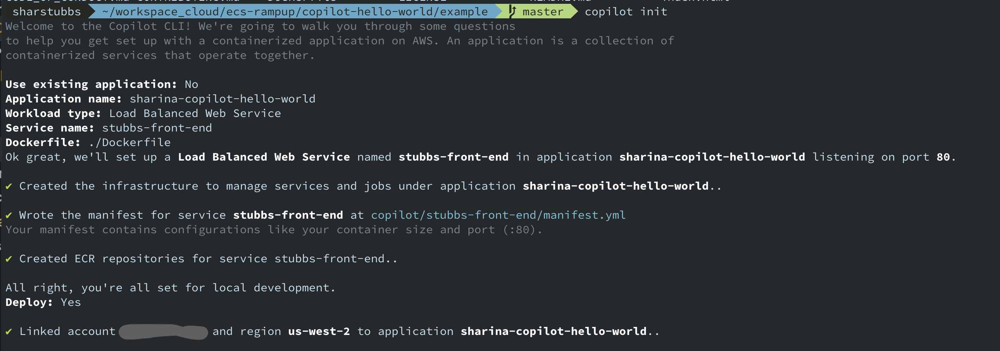
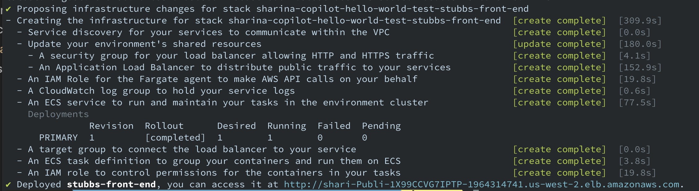

# ECS Copilot Flask App

This repo explores using AWS Copilot to deploy a simple Flask app. It additionally automates development with the a CodePipeline set up by Copilot.

## A Foundational Hello World App

This section outlines steps to deploy a very basic app to get one's feet wet with copilot.

Steps to deploy a first hello world app are here in the [copilot getting started documentation](https://aws.github.io/copilot-cli/docs/getting-started/first-app-tutorial/).

Default setup using `copilot init` can create a dockerfile for you. The following setup lets the app be accessible from the web.



A number of resources are deployed to support ECS during the init-stimulated setup:



The app deployed is a simple static website - frontend only.

## Custom Hello World with Flask

A hello-world Flask app is containerized to explore the options and possiblities with Copilot - everything here on out is based on this Flask app.

A virtual environment was set up, using `pipenv shell` (use `exit` to get out of the virtual env't, and `pipenv --rm` to remove the packages but keep the code, and `psh` to launch a subshell in the vitual environment after exiting.)

Flask was installed with `pip install Flask`.

Requirements file created with `pipenv run pip freeze > requirements.txt` (while virtual environment running).

Tested the app locally:

```bash
export FLASK_APP=app.py
python -m flask run
```

Deployed the app with `copilot init` and updated it with `copilot svc deploy` when changes were made in files.

About ports and exposing them:

* https://docs.docker.com/language/python/run-containers/

### Flask and Docker Documentation

* Flask quickstart - https://flask.palletsprojects.com/en/1.1.x/quickstart/
* Docker and Flask - https://docs.docker.com/language/python/build-images/

## Deployment Options

You can either build everything from scratch, including a VPC, or you can build your ECS-related resources and add them to an existing VPC.

### Create All New Resources

Deploy using the terminal, with the command `copilot init`, and follow the prompts.

Or, run the following command, which assumes knowledge of what is desired:

```bash
copilot init --app [name-of-the-application] \
  --name [name-of-the-service-or-job] \
  --type "Load Balanced Web Service" \
  --dockerfile "./Dockerfile" \
  --deploy
  ```

### Deploy Into An Already existing VPC

Run a series of commands one after another to get very specific about the configuration you want:

Run `copilot app init`, which created copilot/workspace file, and deployed a couple IAM roles into AWS.

Run `copilot env init` to create a name for the environment, ie test. It gives the option to create a new VPC etc, or import an existing VPC and subnets. It provides the VPC names from the account to choose from. A stackset is then deployed to AWS, as well as a cloudformation template with a cluster, IAM and security group resources, etc.

Run `copilot svc init` to create the manifest file and tell it where the docker file is. This is the command that creates a new service to run your code. It will also create an ECR repository for the service. Then, run `copilot svc deploy`.

You'll have one stackset and three stacks deployed in your CloudFormation console, and your command line should produce a URL to view your app.

## Add AWS CodePipeline

Copilot can build an AWS CodePipeline for your app. I used GitHub for version control.

Make sure all the code thus far is nicely stored in a GitHub repo. Run `copilot pipeline init`, which will create a pipeline yaml file and a buildspec file for the pipeline. Then, push the updated code changes to the repo.

To deploy the resources into AWS and be prompted to set up a CodeStar Connection (unless you already added a connection to your pipeline file), run `copilot pipeline update` to build the pipeline. When you create a connection when prompted, if you need to delete a pipeline with copilot, the connection will also be conveniently deleted.

### Delete the Pipeline

Remove all the resources associated with the pipeline with `copilot pipeline delete`.

### Scale the Tasks

To change the number of tasks running, open the manifest file found in the `copilot/stubbs-frontend` directory. The manifest file is a declarative yal template that includes docker image, load balancer requirements, environment variables and resource allocation. Data is dynamically populated from the Dockerfile and from default values.

Change the number of tasks, then run `copilot svc deploy`.
Confirm the deploy with `copilot svc status -n stubbs-frontend`

## Quick Reference of Copilot Commands

To build it all, use `copilot init`.

To update service and resources, `copilot deploy`.

Get Service summary: `copilot svc show`

List of AWS resources associated with service: `copilot svc show --resources`

Check service status: `copilot svc status`

Check service logs: `copilot svc logs`

Get a list of options with `copilot app`.

List the app with `copilot app ls`. Then, plug in the name of the app you found into `copilot app show`.

### Examine the Environment

Get a list of commands with `copilot env`.

### Interact with the Front End Service

List out the commands available with `copilot svc`.

`copilot svc package` produces the CFn template for the service deployment. You'd need to do this if you wanted to start managing CFn deployments manually.

`copilot svc deploy` is the command to use when you need to locally push service changes up to the chosen environment. Once you have a pipeline setup, use the CI/CD workflow instead. If you update the manifest file, this is the command you use to deploy the changes to the cloud environment.

`copilot svc status` provides health and task info, and task count.

### Delete the App

Delete the AWS resources deployed in AWS (all those created from copilot init): `copilot app delete`

## Observations

### VPC CIDR

Copilot init will deploy a VPC before it sets up ECS if default settings are chosen. It will use CIDR 10.0.0.0/16, and if there is another VPC in the account that uses the same, it will use the CIDR regardless.

### Fargate

Copilot uses Fargate.

## Troubleshooting

### Copilot init Freezes

If `copilot init` freezes immediately after the intro statement of "Welcome to the Copilot CLI...," then this is a sign your AWS config and/or credentials file does not have a properly set up default AWS profile.

### Health Check Fails

Flask by default uses port 5000. Checking the logs shows `Running on http://10.0.0.207:5000/`, for example, using the following command.

```bash
copilot svc logs -a [application-name] -n [service-name] --follow
```

Check the Target Group port and make sure it is port 5000. This can be changed by updating the manifest file (image/port) and the dockerfile (`EXPOSE 5000`).

#TODO: Explore changing the app/container port from 5000 to a custom value.

## CloudWatch Container Insights

Metrics include utilization for resources such as CPU, memory, disk, and network. Diagnostic info is also available, such as container restart failures.

### (1) Install JQ

Make sure you have jq installed to extract and transform JSON data. If on a Mac, use Homebrew.

Otherwise use sudo yum: `sudo yum -y install jq gettext`

### (2) Set Environment Variables

Get the cluster arn by checking the clusters available in the AWS account and finding a match of a string:

```bash
cluster_arn=$(aws ecs list-clusters --profile 1s-sandbox | jq -r '.clusterArns[] | select(contains("sharina-ecs-copilot"))')
```

Get the cluster name using variable created above:

```bash
clustername=$(aws ecs describe-clusters --profile 1s-sandbox --clusters $cluster_arn | jq -r '.clusters[].clusterName')
```

Identify the region you're working in:

```bash
export region=us-west-2
```

### (3) Enable Container Insights

Enables Service and Cluster level insights on the targeted ECS cluster:

```bash
aws ecs update-cluster-settings --cluster ${clustername}  --settings name=containerInsights,value=enabled --region $region --profile 1s-sandbox
```

The output will be a block of info about the cluster, a portion of which will show that monitoring is enabled.
When you go into the ECS console, next to the cluster name will be a green check that says "Container Insights." This is in place of a black check next to "Default Monitoring" that was in its place.

### Install Instance Level Insights on the ECS Cluster

The following command creates a stack from a CloudFormation template that deploys a Service into the cluster. More about this in the [CloudWatch docs](https://docs.aws.amazon.com/AmazonCloudWatch/latest/monitoring/deploy-container-insights-ECS-instancelevel.html).

```bash
aws cloudformation create-stack --stack-name CWAgentECS-$clustername-${region} --template-body "$(curl -Ls https://raw-dot-githubusercontent-dotcom.gateway.web.tr/aws-samples/amazon-cloudwatch-container-insights/latest/ecs-task-definition-templates/deployment-mode/daemon-service/cwagent-ecs-instance-metric/cloudformation-quickstart/cwagent-ecs-instance-metric-cfn.json)" --parameters ParameterKey=ClusterName,ParameterValue=$clustername ParameterKey=CreateIAMRoles,ParameterValue=True --capabilities CAPABILITY_NAMED_IAM --region ${region} --profile 1s-sandbox
```

When you go to the console, there will now be an additional service in the cluster. That service does not have a task running.

### Examine the Findings

When you go to CloudWatch Log Groups in the console, the name of the log group is something like
`/aws/ecs/containerinsights/sharina-ecs-copilot-sandbox-Cluster-...` and it will immediately have a bunch of log events to examine.

The CloudWatch console's home page has a dropdown menu next to the word "CloudWatch." Choose `CloudWatch Insights`. Select ECS Clusters in the first dropdown and select the ECS cluster created in the second dropdown. There will be several built-in charts showing various cluster level metrics such as CPU Utilization, Memory Utilization, Network and other information. Clusters, Services and Tasks will all have data points.

While clusters is chosen in from the dropdown, look near the bottom of the page to find the cluster name. Choose the radio button for the cluster and click on the Actions dropdown menu to select Performance Logs. This will take you to CloudWatch Logs and into a specialized search.

## Load Testing

Here are two easy-to-implement load testing options - Hey and Siege. I went with Hey, but if you'd prefer to try Siege, install with Homebrew grab the ALB URL and run with the following command:

```bash
siege -c 200 -i $alb_url
```

This command tells Siege to run 200 concurrent connections to the ECS application at varying URLS.

### Install Hey

If on a Mac, use Homebrew to install: `brew install hey`. It will take a few minutes for everything to kick in, but if you have the manifest file to have scaling of the number of tasks based on CPU, you'll notice the number of tasks increase. More about hey [here](https://github.com/rakyll/hey).

```bash
hey -z 20m http://shari-Publi-7NOS5W3L1E5V-1195326126.us-west-2.elb.amazonaws.com
```
Check the ECS console, CloudWatch alarms, CloudWatch Insights and use the terminal to get Copilot to produce lots of data using `copilot svc show` and `copilot svc status`.

After about 20 minutes, hey will produce a report in the terminal with a summary of the test.

Target tracking is used, which is where when the CPU hits a certain target, it will compare data points collected up to this point to where it is now.

## Get the CloudFormation that Copilot Created

To read the cloudformation for the service, `copilot svc package`.

To print or save the cloudformation use one of the options available with `copilot svc package help`. This allows you to take those resources and edit and use them as you like.